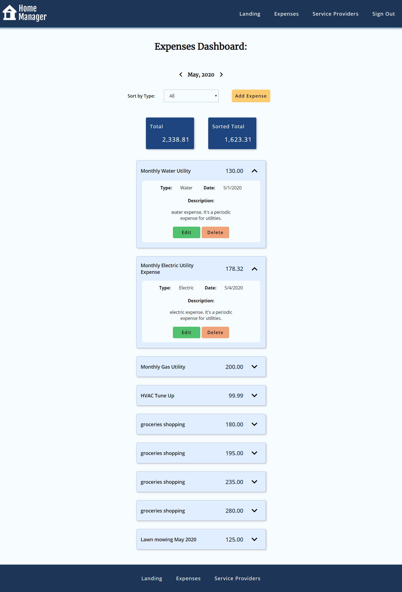
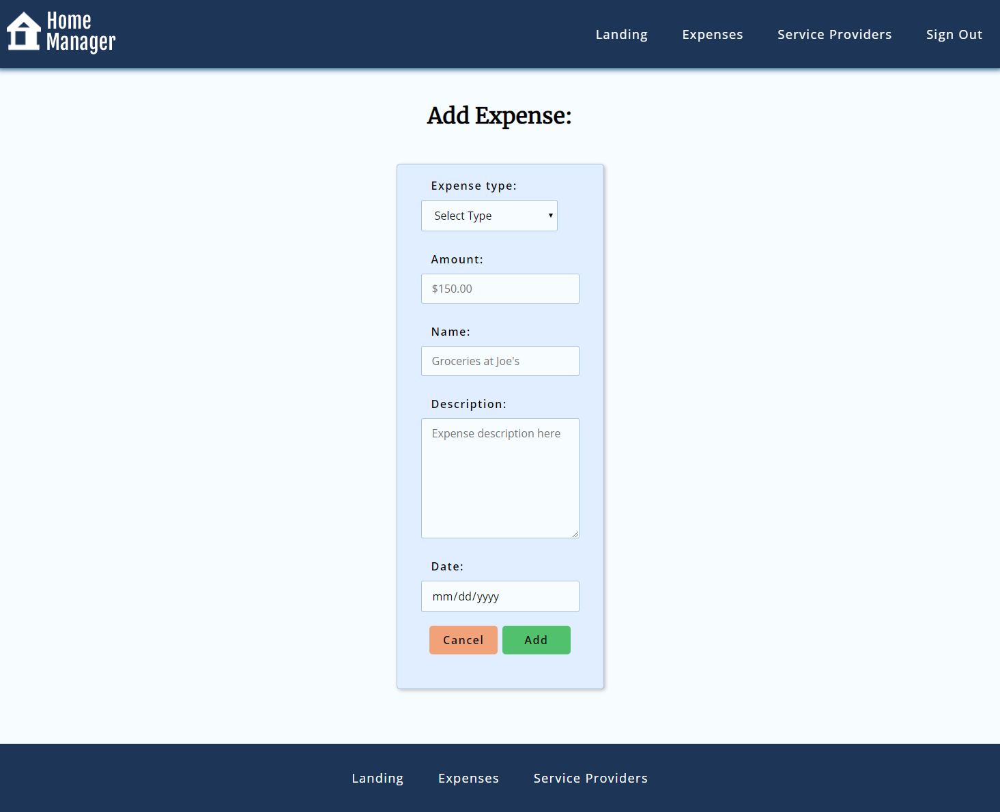
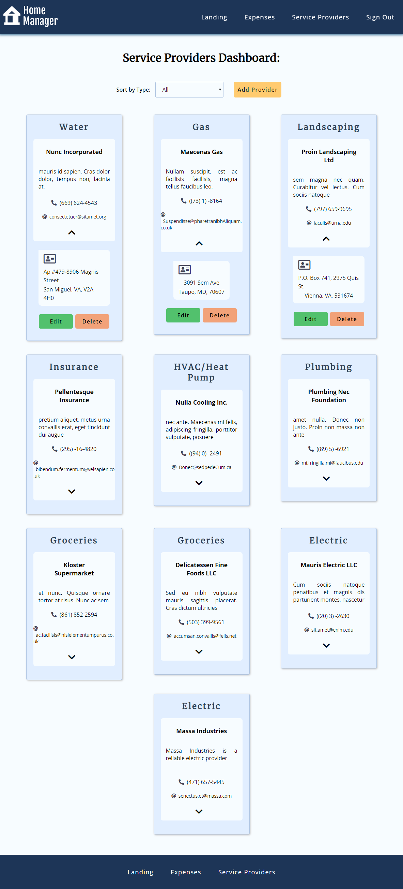
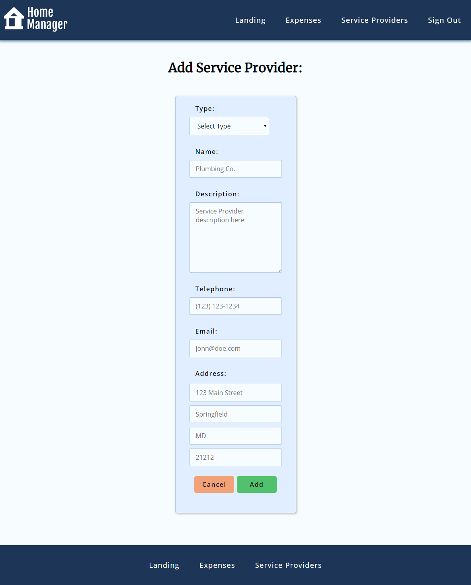

# Home Manager

React client

## Description: 

Homer Manager is a web based cloud-stored expense manager and service provider contacts manager that lets you track periodic expenses for your home for ease of mind.

Home manager lets you store and track periodic home expenses for utilities, food, maintenance, and extraordinary expenses.

At the same time it will let you store and manage a list of contacts for your service providers, to have all the important information in one place readily available.

## Technologies used: 

HTML, CSS, Javascript, React, React-Router, Fetch API

## Live Site

[Landing](https://homemanager-app.now.sh/)

## Log in

To access the application it's neccesary to login with a user and password. Use the following:

username: michael@jones.com
password: michael

## Screenshots:

### Expenses Dashboard:

In the Expenses Dashboard page the user can find all the information about the expenses saved in the app, as well as being able to update and delete any expense in the app:

### Add Expenses:

In the Add Expense page the user will be able to add the expenses:

### Service Providers Dashboard:

In the Service Providers Dashboard the user can find all the information about the service providers saved in the app, as well as being able to update and delete any service provider in the app:

### Add Service Provider:

In the Add Service Provider page users will be able to add the service providers:

## Set up

Complete the following steps to start a new project (NEW-PROJECT-NAME):

1. Clone this repository to your local machine `git clone https://github.com/rodrigohervas/home-manager-client NEW-PROJECT-NAME`
2. `cd` into the cloned repository
3. Make a fresh start of the git history for this project with `rm -r Force .git` and `git init`
4. Make sure that the .gitignore file is encoded as 'UTF-8'
5. Edit the contents of the `package.json` to use NEW-PROJECT-NAME instead of `"name": "home-manager-client",`

## Related Repo:

[Home Manager API](https://github.com/rodrigohervas/home-manager-api)

## Scripts

Start the application `npm start`
